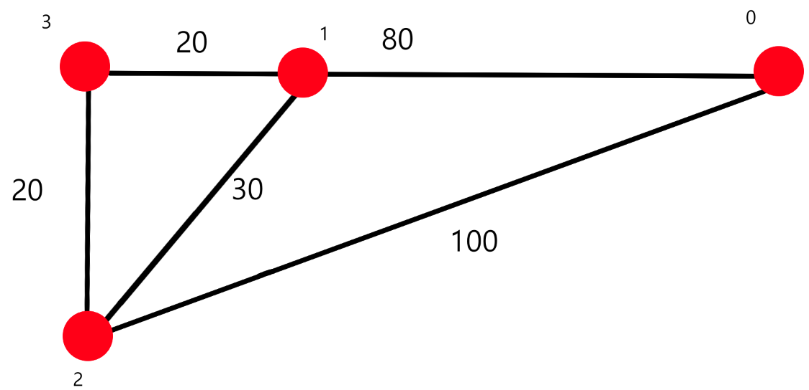
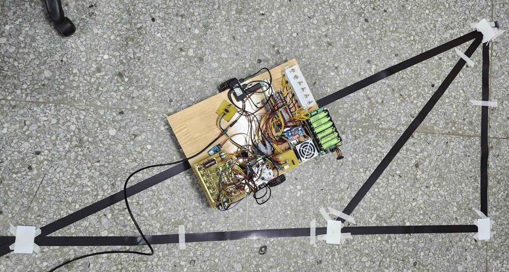
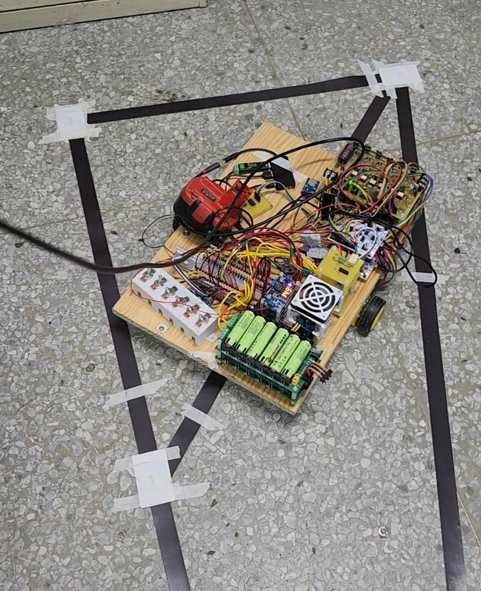

# AGV 自動導引車（專題）

> 此專案主要由兩份 STM32 專案組成 `principal_program` 與 `ancillary_program` 的結構摘要

## 簡介
本專題為一套基於磁條+多感測器導引的 AGV（自動導引車）系統。此 repo 包含示範影片，以及控制/模擬程式結構範例。
repo重點為：
- 磁條追蹤與偏移時的尋回策略（示範：先右轉 80°，若仍未找到再左轉 160° 搜尋）
- 使用 FIFO Queue 的任務序列（可於電腦端一次輸入多個節點 ID，AGV 會依序前往）
- 兩支示範影片（放於 `videos/`）展示上述行為

## 功能重點
- 自動磁條追蹤與校正
- 脫離磁條時的尋回演算法（右轉 90° → 左轉 180°）
- 任務 Queue：在電腦端輸入節點序列（例如 `1 3 5 2`），AGV 依序執行

## 影片說明（點圖可在新分頁觀看，圖片下方也有連結）

### 地圖說明
- 紅點為節點(小字的0 1 2 3)
- 而每個路徑上的數字則是點到點間路徑的權重(模擬距離長度)

### 影片 A — AGV 正常工作行走（Queue 任務序列示範）
簡短說明：示範如何於電腦端一次輸入一連串節點 ID（`0 -> 1 -> 3 -> 2 -> 1 -> 3 -> 0`）。
程式把節點加入 FIFO 的 Queue，AGV 會依序前往並在到達節點執行相應動作。

影片連結（若點圖沒反應，請直接複製貼上）：
https://youtube.com/shorts/Torc2boiYbU?feature=share

補充說明：
- 影片展示：使用者輸入節點序列 → 程式建置 Queue → AGV 依序取出節點並前往 → 到達後執行停靠/報到等動作 → 重複直到 Queue 空。

---
**建議時間軸**：
- 00:00 — 輸入節點序列並啟動(已經往前一段距離了)
- 00:10 — AGV 經過節點1並進入節點3進行最佳判斷後選擇`順時鐘旋轉`
- 00:20 — 進入節點2並經由已經計算好的路徑璇則最短的執行路徑，因此順時針選轉並直接前往節點1
- 00:40 — 進入節點1，並往節點3
- 01:00 — 進入節點3，並往節點0
- 01:30 — 進入節點0，並停止動作待機，等待電腦再次下達下個任務
---

### 影片 B — AGV 自主回到磁條並繼續工作行走（脫離尋回示範）
簡短說明：示範 AGV 在脫離磁條時啟動尋回策略：**先右轉 80°** 掃描 → **再左轉 160°** 掃描，找到磁條後微調回到磁條中心並繼續原任務。

<!-- 點擊縮圖在新分頁開啟 YouTube -->

影片連結（若點圖沒反應，請直接複製貼上）：
https://youtube.com/shorts/myp7lJjNSJw?feature=share

補充說明：
- 影片展示：脫離偵測 → 右轉 80° 掃描(若未感應到軌道，則執行左轉 160° 掃描) → 偵測到後對齊回歸並繼續行駛。

**行為重點**：當感測器連續 N 次偵測不到磁條時，觸發尋回流程：
1. 右旋轉 80°（在旋轉過程同步掃描hall感測器）。
2. 進入脫軌到進入循跡mode間的過度演算法模式，持續修正行進方向。
3. 當多個hall感應確實感應到磁條，卻認為進入正常軌道。
4. 正式進入循跡mode，繼續執行任務。

---
**建議在 README 中標示時間軸**（方便評估與 Debug）：
- 00:00 — 測試已經處於脫軌狀態
- 00:02 — 右轉 80° 掃描
- 00:05 — 左轉確認已經恢復指軌道上
- 00:10 — 確定進入軌道並開啟循跡模式
---
